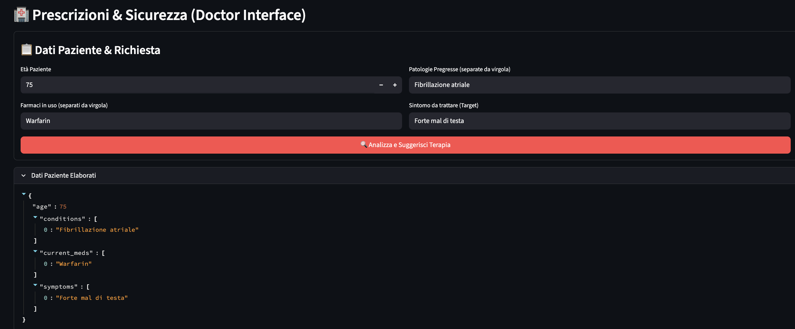
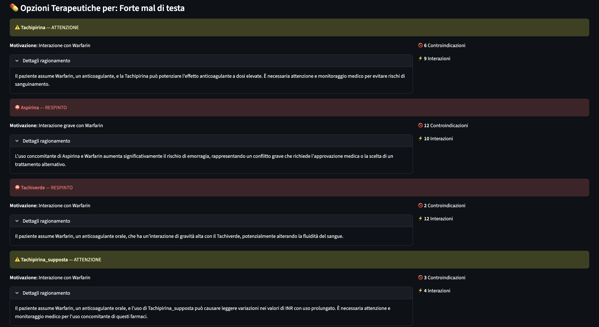
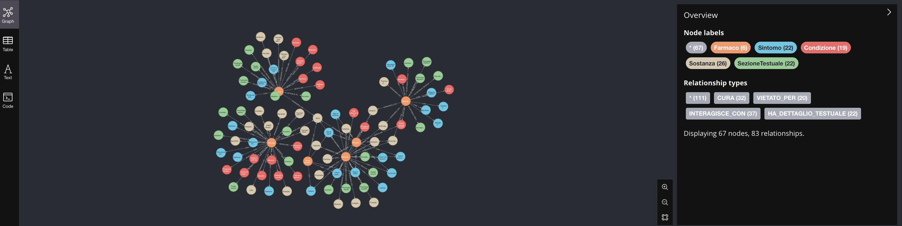

# 🩺 PharmaGraph: Clinical Decision Support System (GraphRAG Prototype)

> **Progetto Didattico / Proof of Concept**
>
> Questo repository ospita un **Minimum Viable Product (MVP)** sviluppato per esplorare l'applicazione di architetture **GraphRAG (Retrieval-Augmented Generation su Knowledge Graph)** in ambito sanitario. L'obiettivo è dimostrare come l'unione di **Neo4j** e **Large Language Models (LLM)** possa superare i limiti dei sistemi tradizionali nel controllo della sicurezza farmacologica.

---

## 🎯 Obiettivi e Scopo del Progetto

Il cuore del progetto è la realizzazione di un assistente intelligente per il supporto decisionale clinico. L'obiettivo primario è risolvere la complessità di consultazione dei **Foglietti Illustrativi (RCP)**, trasformandoli da documenti statici in dati connessi.

Il sistema realizza questo scopo attraverso:
1.  **Ingestion di Foglietti Illustrativi:** Estrazione e strutturazione automatica dei dati dai PDF medici all'interno di un Knowledge Graph.
2.  **Ricerca Semantica sui Sintomi:** Permettere al medico di cercare una terapia descrivendo il problema in linguaggio naturale (es. "forte mal di testa") senza dover conoscere a memoria il nome del farmaco o la categoria esatta.
3.  **Safety Check Personalizzato:** Incrociare i farmaci candidati con la **storia clinica pregressa** del paziente (anamnesi) e le sue **terapie in corso**, rilevando automaticamente interazioni e controindicazioni che potrebbero sfuggire a un controllo manuale.

Dal punto di vista tecnico ed educativo, il progetto serve a padroneggiare concetti avanzati di AI Engineering:
* **GraphRAG vs Standard RAG:** Superare i limiti del RAG vettoriale "puro" (che spesso soffre di allucinazioni su regole rigide) integrando dati strutturati deterministici.
* **Orchestrazione di Agenti:** Coordinare più agenti AI (Retriever, Validator, Safety Advisor) usando **LangChain**.
* **Neo4j & Cypher:** Modellazione di dati complessi (interazioni farmacologiche n-a-n) tramite database a grafo.
* **Prompt Engineering Avanzato:** Tecniche di *Chain-of-Thought* per guidare l'LLM in ragionamenti logico-matematici (es. calcolo età vs limiti di somministrazione).

---

## 🧠 Perché un Knowledge Graph? (Graph vs Relazionale)

Nel settore sanitario, le relazioni tra entità (Farmaco A interagisce con Sostanza B, che è contenuta in Farmaco C) sono fondamentali. Ecco perché ho scelto un approccio a grafo rispetto a un classico database SQL:

| Feature | Database Relazionale (SQL) | Knowledge Graph (Neo4j) |
| :--- | :--- | :--- |
| **Modellazione Dati** | Richiede tabelle di join complesse per gestire relazioni "molti-a-molti" (es. interazioni). | Le relazioni sono "cittadini di prima classe". Il modello riflette la realtà clinica: `(Farmaco)-[:VIETATO_PER]->(Condizione)`. |
| **Performance** | Le query con molti JOIN (es. "Trova interazioni tra 5 farmaci e 3 patologie") degradano esponenzialmente. | Il "Graph Traversal" mantiene performance costanti anche con query profonde e complesse. |
| **Flessibilità** | Aggiungere nuovi tipi di relazioni (es. "Interazione Cibo-Farmaco") richiede modifiche allo schema rigido. | Schema-less: è possibile aggiungere nuove relazioni dinamicamente senza rompere l'esistente. |
| **AI Integration** | L'LLM fa fatica a scrivere SQL complessi (rischio errori sintattici). | Il grafo fornisce un contesto strutturato ("Ground Truth") che l'LLM può leggere facilmente per ridurre le allucinazioni (Hallucination Reduction). |

---

## 📸 Demo & Screenshots

### 1. Dashboard Medico (Form Strutturato)
*L'interfaccia permette al medico di inserire dati strutturati (età, patologie, politerapia) invece di testo libero ambiguo.*



### 2. Analisi di Sicurezza e Ragionamento
*Il sistema rileva un rischio (es. Età < 15 anni) e spiega il "perché" clinico, incrociando i dati del grafo.*



### 3. Il Knowledge Graph (Backend Neo4j)

L'immagine mostra un cluster di esempio:

*(Nota: Questo grafo permette query di "pathfinding" impossibili su SQL, come trovare tutti i farmaci che curano il sintomo X ma non interagiscono con la condizione Y)*

---

## ⚙️ Architettura Tecnica

Il sistema segue una pipeline a stadi:

1.  **Semantic Search (Vector Index):**
    * L'input del sintomo (es. "Forte mal di testa") viene convertito in embedding (`text-embedding-004`).
    * Una ricerca vettoriale su Neo4j recupera i farmaci semanticamente pertinenti (es. trova "Tachipirina" anche se l'utente non scrive "Paracetamolo").

2.  **Clinical Validation Agent:**
    * Un Agente LLM verifica che i farmaci trovati siano *realmente* indicati per il sintomo, consultando le "Indicazioni Ufficiali" salvate nel grafo (filtrando falsi positivi vettoriali).

3.  **Deterministic Safety Check:**
    * Per ogni farmaco candidato, il sistema estrae dal Grafo il sottografo delle regole:
        * `(:Farmaco)-[:VIETATO_PER]->(:Condizione)`
        * `(:Farmaco)-[:INTERAGISCE_CON]->(:Sostanza)`
    * Queste regole rigide vengono passate al **Safety Agent**.

4.  **LLM Reasoning:**
    * Il modello (`gpt-oss-120b` via Groq) agisce come giudice finale, applicando le regole estratte al profilo specifico del paziente (es. calcola `12 anni < 15 anni` = **RESPINTO**).

---

## 🛠️ Tech Stack

* **Core:** Python 3.10+
* **Database:** Neo4j (Graph DB + Vector Index)
* **LLM Inference:** Groq Cloud (gpt-oss-120b) per bassa latenza.
* **Embeddings:** Google Generative AI (`text-embedding-004`) per alta precisione semantica in italiano.
* **Orchestration:** LangChain.
* **Frontend:** Streamlit.

---

## 🚀 Installazione e Avvio

1.  **Clona il repository:**
    ```bash
    git clone [https://github.com/sfid98/PharmaGraph-RAG.git](https://github.com/sfid98/PharmaGraph-RAG.git)
    cd PharmaGraph-RAG
    ```

2.  **Crea un Virtual Environment:**
    ```bash
    python -m venv venv
    source venv/bin/activate  # Su Windows: venv\Scripts\activate
    ```

3.  **Installa le dipendenze:**
    ```bash
    pip install -r requirements.txt
    ```

4.  **Configura le Variabili d'Ambiente:**
    Crea un file `.env` nella root del progetto e inserisci le tue credenziali (Neo4j, Google, Groq):
    ```env
    NEO4J_URI=bolt://localhost:7687
    NEO4J_USERNAME=neo4j
    NEO4J_PASSWORD=tua_password
    GOOGLE_API_KEY=tua_google_key
    GROQ_API_KEY=tua_groq_key
    ```

5.  **Popolamento del Knowledge Graph (Data Ingestion):**
    Il database Neo4j è inizialmente vuoto. Esegui lo script di ingestion per caricare i dati strutturati (dal file `data/farmaci_demo.json`), creare i nodi (Farmaci, Sintomi, Condizioni) e generare gli embedding vettoriali.
    
    ```bash
    # Assicurati che Neo4j sia attivo
    python src/ingestion.py
    ```
    *(Attendi il messaggio di conferma "Ingestion completata e indici creati")*

6.  **Avvia l'applicazione:**
    ```bash
    streamlit run src/app.py
    ```

## ⚠️ Disclaimer

Questo software è un **prototipo dimostrativo (POC)** creato a fini di studio e ricerca nell'ambito dell'AI Engineering.

* Non è un dispositivo medico certificato.
* I dati utilizzati sono parziali e a scopo di test.
* Non deve essere utilizzato per decisioni cliniche reali.

---
